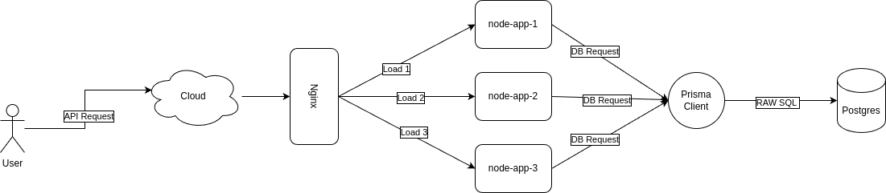

> Written with [StackEdit](https://stackedit.io/).
# Express and Book/Author Managment System API

  

Submission by abhishtchouhan@gmail.com. 

  

**How to Run**

  

- First run all the Docker Contianers: `sudo sh start.sh`

- Go to [Postman Documentation](https://documenter.getpostman.com/view/27785342/2s9YsMAX2X#646bc33e-a6e6-4f4d-b18a-69ff6b14985f), the Docs will be loaded (Read the Operator Guider before Proceeding)d

- All apis are accessible from  `http://localhost:3000 `
 Read the API References before Proceeding.

  

  

## **How to Operate**

- All major datasets will load within seconds, thanks to the presence of 3 concurrent Node Apps running with **Load Balancing** capability. It's a **Microservice Architecture**, so running all standalone services on one machine might consume additional memory

- Go to http://localhost:3000, the API's will be available

- Some routes require authentication as per assignment requirements. The authentication cookies will be managed by the server automatically. Calling the right API at the right time will provide a seamless experience on the platform. Please read the Postman Docs before making API calls.

- Postgres Database is inside the Docker. Please read the Docker Guide to connect it with External Driver.

  

## Features

|Features| In Service |

| Multi-Core Concurrency | ✅ |

| Load Balancing |✅ |

| Automated Database Cleaning and Structuring on Server Startup | ✅ |

| RBAC on Authentication | ❌ |

| Real/Near Real-Time Fake Data Injection | *✅ |

| Multi-Parameters Orderby and SortBy  | ✅ |

| Dockerzie - Fully Ready for Production | ✅ |

| Backend Managed Authentication | ✅ |

| API's Available with Health Checkup | ✅ |

| Postman Documentation | ✅

| SQL Transcations & SQL Injection Protected| ✅

   

**Things to know :**

  

1. Ignoring RBAC as i'm short on Time. Refer my: [RBAC Repo](https://github.com/imabhisht/edtech-management)

2. All the routes are functioning properly. I haven't added a separate data validation module as it is not currently required. However, at some level, the backend will be able to handle incomplete API requests or incorrect data fill-ups.

3. Being a fully Prisma-based app, there is no chance of SQL injection. All queries strictly adhere to the properties of ACID (Atomicity, Consistency, Isolation, Durability). At every startup, the database will be deleted, and a new data structure will be inserted.

4. Yea that's it. Not got much time, but tired my best to submit this assignment. Contact me incase any issue on the code.

  

  
  

## System Design

  

### Components:

  

1.  **Node Express App:**

- An Express server serving as the API Service, receiving logs over HTTP on port `3000`.

- All the code is in a modular format and is clear to understand. I have also added comments where necessary.

2.  **Nginx:**

- To perform load balancing over more than 3 Node Apps on each core.

- This will provide concurrency and result in fast response times for end-users.

3.  **Postgres Database:**

- Postgres is employed as the backend database for storing and indexing data efficiently.

- Provides triggers and indexes making it suitable for querying information.

4.  **Docker:**

- Out-of-the-box , Ready for Production Deployment.

- Enhances system scalability, allowing independent services to attach with others components.

  

### System Architecture:

  

-  **Decoupling:**

- Prisma Client and Node App are not dependent to each other.

- Prisma Client acts as a database interface, facilitating asynchronous communication between components and Node.js logic

-  **Scalability:**

- Nginx scalling allows for horizontal scalability, enabling efficient handling of increasing api requests.

- Independently scalable components: The Express server can scale based on the workload.

-  **Durability and Fault Tolerance:**

- Docker ensures durability by persisting restart commands and logs messages.

- Fault-tolerant architecture: In case of component failures, node-app logs retains messages, and the node-app-x(1,2,3) can catch up.

-  **Asynchronous Processing:**

- Asynchronous log processing enables the node-app to continue apis services without waiting for single database operation to complete.

  

  

### Conclusion:

  

This system architecture leverages the synergy of Prisma for efficient PostgreSQL database interactions, Node.js for server-side logic, Docker for seamless containerization, and NGINX for load balancing, resulting in a robust and scalable application deployment.

Prisma, with its PostgreSQL integration, ensures a reliable and performant data storage solution. Node.js, as the server-side runtime, facilitates the execution of business logic and manages communication between the frontend and the database. Docker containerization streamlines deployment by encapsulating the application, dependencies, and environment settings, ensuring consistency across various stages of the development lifecycle.

The inclusion of NGINX as a load balancer enhances system scalability and reliability by distributing incoming traffic across multiple instances of the application. This decoupled architecture promotes modularity, making it easier to scale individual components independently, contributing to fault tolerance and adaptability.

Together, Prisma, PostgreSQL, Node.js, Docker, and NGINX create a powerful and efficient system, well-suited for managing and processing data in a scalable, fault-tolerant, and maintainable manner.

  
  
  
  

**API's References**
- Go to [Postman Documentation](https://documenter.getpostman.com/view/27785342/2s9YsMAX2X#646bc33e-a6e6-4f4d-b18a-69ff6b14985f), the Docs will be loaded (Read the Operator Guider before Proceeding)
  

